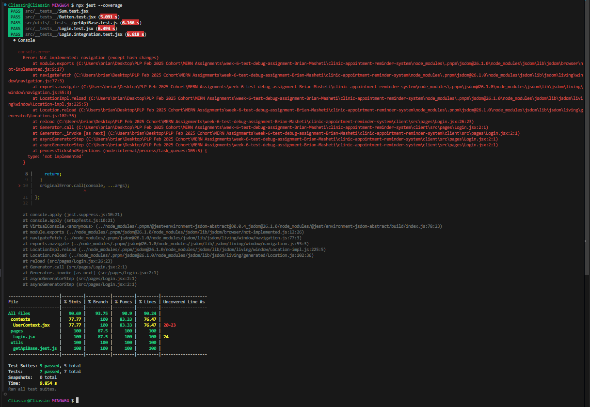
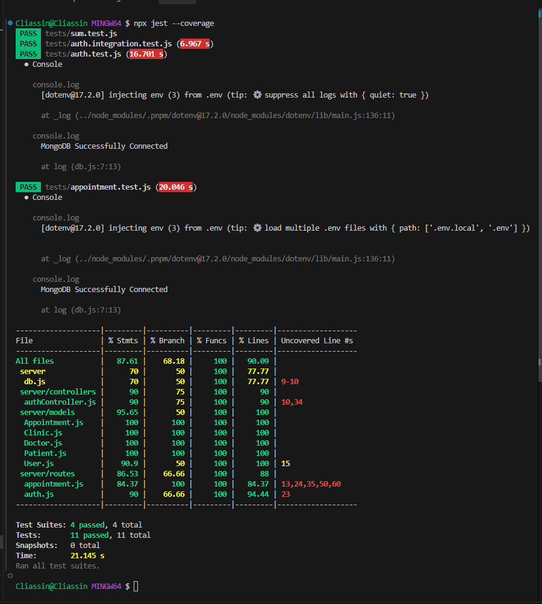

> **⚠️ This project is under active development. Some features may be incomplete or subject to change.**

<p align="center">
  
</p>

# 🏥 HealthTrack Appointment System

A full-stack MERN application for managing clinic appointments, with robust testing, debugging, and fully responsive design for both desktop and mobile.

---

## 🚀 Features

- User registration and login (Doctor/Patient)
- Appointment creation, update, and soft-delete
- Doctor and patient dashboards
- Clinic management
- Automated reminders (future scope)
- Comprehensive unit, integration, and end-to-end testing
- **Fully responsive UI:**
  - Sidebar and main content adapt to all screen sizes
  - All tables become cards on mobile
  - Forms and dropdowns stack vertically on mobile
  - Quick links with icons, stacked for mobile usability

---

## 📦 Project Structure

```
clinic-appointment-reminder-system/
│
├── client/         # React frontend (Vite, Tailwind, Cypress, Jest)
│   ├── src/
│   ├── public/
│   ├── coverage/
│   └── ...
│
├── server/         # Express backend (Jest, Supertest, MongoDB)
│   ├── controllers/
│   ├── models/
│   ├── routes/
│   ├── tests/
│   ├── coverage/
│   └── ...
│
├── .gitignore
├── README.md
└── ...
```

---

## 🧪 Testing Strategy

### Client (React)
- **Unit tests:** React components, utility functions (`Jest`, `@testing-library/react`)
- **Integration tests:** Component/API interaction, form handling
- **E2E tests:** User flows with `Cypress` (`cypress/e2e/*.cy.js`)
- **Coverage:** Run `npx jest --coverage` in `client` for a detailed report

### Server (Express)
- **Unit tests:** Utility functions, controllers
- **Integration tests:** API endpoints with `Supertest`
- **Database isolation:** Test DB is cleared before each test
- **Coverage:** Run `npx jest --coverage` in `server` for a detailed report

---

## 🐞 Debugging Techniques

- **React error boundaries** for catching UI errors
- **Express error handling middleware** for API errors
- **Logging:** Console logs for DB connection, errors, and test setup
- **.env files:** All secrets and URIs are kept out of source code

---

## 🛠️ Setup & Usage

### 1. Clone the repository
```sh
git clone <your-repo-url>
cd clinic-appointment-reminder-system
```

### 2. Install dependencies
```sh
cd client && pnpm install
cd ../server && pnpm install
```

### 3. Set up environment variables
- Copy `.env.example` to `.env` in both `client` and `server` and fill in your values.

### 4. Run the app
- **Client:** `pnpm dev` (in `client`)
- **Server:** `pnpm start` (in `server`)

### 5. Run tests
- **Client:** `npx jest` or `npx jest --coverage`
- **Server:** `npx jest` or `npx jest --coverage`
- **E2E:** `pnpm test:e2e` (Cypress)

---

## 📱 Responsive Design Highlights

- **Sidebar:** Collapses to icons on mobile, expands on desktop
- **Main Content:** Always visible, never overlapped by sidebar
- **Tables:** Become cards on mobile for patients, clinics, appointments
- **Forms & Dropdowns:** Stack vertically on mobile, row on desktop
- **Quick Links:** Stacked with icons for mobile, grid/row for desktop

---

## 📸 Coverage Reports

- **Client Coverage:**
  <p align="center">
    
  </p>
- **Server Coverage:**
  <p align="center">
    
  </p>

---

## 📄 Submission Checklist

- [x] All tests passing (unit, integration, E2E)
- [x] Coverage reports/screenshots included
- [x] Documentation of testing, debugging, and responsive design
- [x] `.gitignore` excludes test files, node_modules, and secrets
- [x] Regular commits pushed to GitHub Classroom repo

---

## 👨‍💻 Author

- Brian Masheti

---

## 📝 License

This project is for educational purposes (PLP Feb 2025 Cohort).
